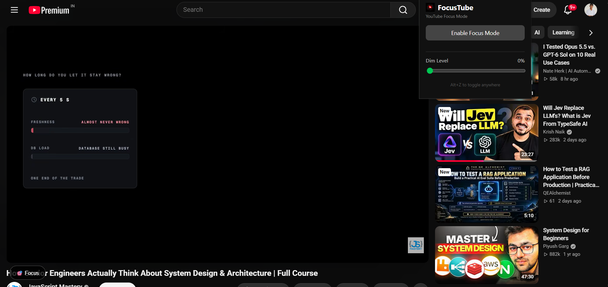
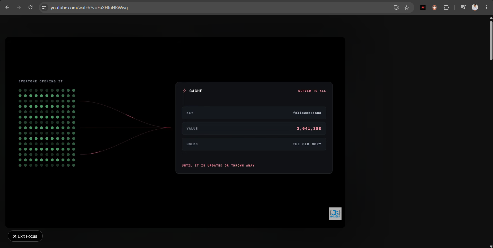

<p align="center">
  
</p>

<h1 align="center">FocusTube</h1>

FocusTube is a lightweight browser extension that creates a distraction-free YouTube viewing experience for learning, tutorials, and intentional watching.

It keeps the video player in place while hiding the surrounding elements that pull attention away from the video.

[Install FocusTube from Microsoft Edge Add-ons](https://microsoftedge.microsoft.com/addons/detail/cjhibbneibhhcjiiekbhfgiilhijgibo)

## See the difference

FocusTube leaves the video player untouched while reducing the visual noise around it.

| Before enabling Focus Mode | Focus Mode active |
| --- | --- |
|  |  |

## Features

- Hide recommendations, comments, navigation, metadata, channel details, action panels, and playlist sidebars.
- Apply a configurable dim overlay without covering the video player.
- Toggle Focus Mode from the extension popup, the floating in-page control, or `Alt + Z`.
- Preserve the dim preference and temporary Focus Mode state per tab.
- Continue Focus Mode across YouTube's single-page video navigation.
- Run entirely in the browser with no accounts, analytics, trackers, or remote code.

## Install

### Microsoft Edge

FocusTube is available directly from Microsoft Edge Add-ons:

[Install FocusTube from Microsoft Edge Add-ons](https://microsoftedge.microsoft.com/addons/detail/cjhibbneibhhcjiiekbhfgiilhijgibo)

Click **Get** and the extension will be installed automatically.

---

### Google Chrome

FocusTube is not yet available on the Chrome Web Store, but you can install it manually in a few steps.

#### Option 1 — Download ZIP

1. Go to the [FocusTube GitHub repository](https://github.com/Xenon010101/FocusTube).
2. Click **Code → Download ZIP**.
3. Extract the downloaded ZIP file.
4. Open Chrome and go to:

   ```text
   chrome://extensions

## Usage

Enable or disable Focus Mode on a YouTube watch page using any of the following:

- The FocusTube toolbar popup.
- The floating Focus button in the lower-left corner of the page.
- The `Alt + Z` keyboard shortcut.

Use the popup slider to adjust the dim level. If the keyboard shortcut does not work, assign it in your browser's extension-shortcut settings:

- Chrome: `chrome://extensions/shortcuts`
- Microsoft Edge: `edge://extensions/shortcuts`

## Privacy

FocusTube does not collect, transmit, sell, or share personal data. It does not use analytics, advertising, trackers, accounts, or remotely hosted code.

Browser storage is used only for:

- Your dim-level preference.
- Temporary per-tab Focus Mode state during the browser session.

Read the full [Privacy Policy](https://xenon010101.github.io/FocusTube/PRIVACY.html).

## Development

FocusTube is a Manifest V3 extension with no build step and no third-party runtime dependencies.

| File | Purpose |
| --- | --- |
| `manifest.json` | Extension metadata, permissions, content-script registration, popup, icons, and shortcut. |
| `content.js` | Focus Mode behavior, dim overlay, YouTube navigation handling, and in-page controls. |
| `content.css` | Styles for the overlay, hidden elements, and floating control. |
| `popup.html`, `popup.js`, `popup.css` | Toolbar popup and dim-level controls. |
| `background.js` | Keyboard command handling and per-tab session state. |

After making changes, reload the unpacked extension from the browser's extensions page. Test the popup, dim slider, floating control, `Alt + Z`, and navigation between YouTube videos.

## Contributing

Contributions, bug reports, and feature requests are welcome. Please keep changes aligned with the extension's single purpose: reducing distractions on YouTube watch pages.

## License

This project is licensed under the [MIT License](LICENSE).
